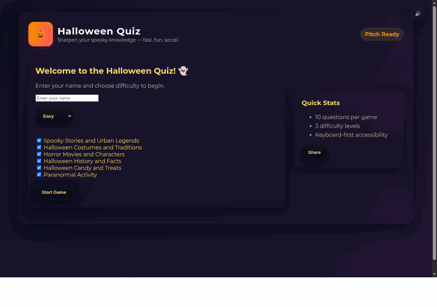

# Halloween Quiz Game 🎃

An interactive Halloween-themed quiz game with multiple categories and spooky fun!

## Features
- Multiple quiz categories:
  - Spooky Stories and Urban Legends 👻
  - Halloween Costumes and Traditions 🎭
  - Horror Movies and Characters 🎬
  - Halloween History and Facts 📚
- Three difficulty levels (Easy, Medium, Hard)
- Time limits for extra challenge
- Dynamic scoring based on difficulty
- ASCII art for visual atmosphere
- High score tracking
- Customizable quiz experience
- Personalized feedback
- Random question selection
- Interactive command-line interface

## Quick Start

1. Clone the repository:
```bash
git clone https://github.com/jafta1083/halloween.git
cd halloween
```

2. Create and activate a virtual environment:
```bash
python -m venv venv
source venv/bin/activate  # On Windows use: venv\Scripts\activate
```

3. Install dependencies:
```bash
pip install -r requirements.txt
```

4. Run the game:
```bash
python src/game.py
```

## How to Play
1. Enter your name when prompted
2. Choose which quiz categories you want to include
3. Answer the questions by selecting the number of your chosen answer
4. See your score and get a personalized message at the end!

## Contributing
Feel free to contribute new questions by adding them to the `assets/questions.json` file!

## Run game local
/home/jafta/Desktop/halloween/venv/bin/python src/game.py
## Demo

<p align="center">
  
</p>

*Demo: short gameplay preview.*
